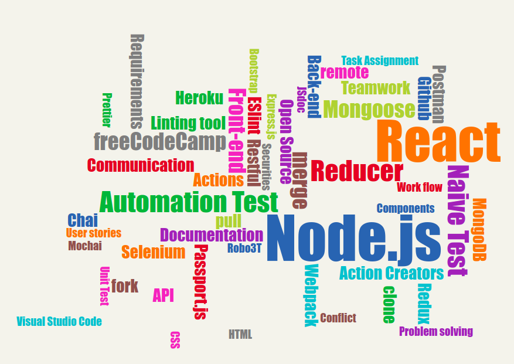

# Free Code Camp Hanoi Blog Project (Back-end)

## Giới thiệu chung
---

- **fcchn-blog** là dự án làm 1 platform giúp mọi người chia sẻ bài viết, với mục đích để học: *front-end* (React) và *back-end* (Nodejs, Express và MongoDB) của 1 nhóm các thành viên Facebook group [freeCodeCamp Hà Nội](https://www.facebook.com/groups/free.code.camp.hanoi/).
    - Front-end:
        - Github source code được lưu tại [đây](https://github.com/freeCodeCamp-Hanoi/blog-app-front-end-01). 
        - Đã được deploy lên Heroku tại [đây](https://fcchn-blog-frontend.herokuapp.com/). Để xem bài và viết bài, bạn có thể đăng ký user và password mới, hoặc sử dụng username/password là fcchanoi/123456.
    - Back-end:
        - Github source code được lưu tại [đây](https://github.com/ngminhtrung/fcchn-blog-backend)
        - Đã được deployed lên Heroku tại [đây: https://fcchn-blog.herokuapp.com](https://fcchn-blog.herokuapp.com). Để sử dụng được api của backend, xin vui lòng xem phần [mô tả về Data Model](https://github.com/ngminhtrung/fcchn-blog-backend/blob/master/readme-datamodel.md).

- Những thành viên đăng ký học, code, và đóng góp cho dự án này bao gồm:

    |Back-end                                                       | Front-end|
    |---                                                            |---                            |
    |1. [Nguyễn Thế Phụng Long](https://github.com/thelonglqd)      |1. [Nguyễn Khắc Việt](https://github.com/bangnokia) |
    |2. [Nguyễn Thế Tùng](https://github.com/tungnt-580)            |2. [Nguyễn Thế Tùng](https://github.com/tungnt-580) |
    |3. [Vũ Tùng](https://github.com/vutung3196)                    |3. [Nguyễn Minh Trung](https://github.com/ngminhtrung) |
    |4. [Khắc Thành](https://github.com/narutoo9x)                  |           |
    |5. [Nguyễn Minh Trung](https://github.com/ngminhtrung)         |           |
 
- Tài liệu quan trọng khác trong dự án:
    - [Mô tả về data model](https://github.com/ngminhtrung/fcchn-blog-backend/blob/master/readme-datamodel.md)
    - [Đóng góp cho dự án](https://github.com/ngminhtrung/fcchn-blog-backend/blob/master/Contributing.md)
    - [Cách cài ứng dụng](https://github.com/ngminhtrung/fcchn-blog-backend/blob/master/Contributing.md)
    - [Câu hỏi](https://github.com/ngminhtrung/fcchn-blog-backend/blob/master/readme-faq.md)
    - [Tools sử dụng để test](https://github.com/ngminhtrung/fcchn-blog-backend/blob/master/readme-tools.md)
    - [API documentation](https://github.com/ngminhtrung/fcchn-blog-backend/blob/master/doc/index.html)

## Tiến độ & Đánh giá:

- Dự án bắt đầu từ tuần 1 của tháng 1 năm 2018, và kết thúc vào ngày 19 tháng 3 năm 2018. 
- Front-end:
    - Phần tính năng đã hoàn thành 90%, còn một vài lỗi lặt vặt. 
    - Giao diện cần được chỉnh sửa chau chuốt hơn. 
    - Đánh giá tổng thể hoàn thành khoảng 60%.
- Back-end:
    - Phần tính năng đã xong. 
    - So với các mục tiêu đề ra (bao gồm cả test, documenation, bảo mật, v.v. ) thì đã hoàn thành được khoảng 80% - 90%. 
- Cả front-end và back-end đã được test trên local. 
- Toàn bộ đã được deploy lên heroku. Kiểm tra tại đây: https://fcchn-blog-frontend.herokuapp.com/

## Tính năng và công nghệ

Là một platform để viết blog, nơi các thành viên có thể viết blog, đăng bài, xem bài của mình cũng như của người khác, bình luận vào bài của người khác. Sản phẩm này sẽ học theo các platform viết blog khác như Medium nhưng chỉ dừng ở mức cơ bản. Mục đích cuối cùng vẫn là nắm bắt được những công nghệ cần dùng cho 1 sản phẩm hoàn thiện (xem thêm mục "*Những điều học được qua dự án này*" ở bên dưới)

### Tính năng chi tiết

1. Đăng ký
2. Đăng nhập
3. View profile
4. Chỉnh sửa profile
5. Viết blog mới
6. Chỉnh sửa blog cũ
7. View danh sách blog của bản thân
8. View blog của người khác
9. Xóa blog
10. Comment
11. Like
12. Share Facebook

### Công nghệ sử dụng

- Front-end: 
    - React
    - Bootstrap
- Back-end:
    - Node.js
    - Express.js
    - MongoDB-moongoose
- Testing:
    - Unit test: Karma, Mochai, Chai, Sinon
    - Automation test: Selenium
- Bảo mật

### Công cụ sử dụng

1. Visual Design: Gravit Designer
2. Visual Studio Code

### Cấu trúc

- client
- server
- test
- configuration

## Những điều học được qua dự án này
---

- [x] Cách đóng góp vào dự án mã nguồn mở trên Github
    - [x] Hiểu về Git cơ bản: `clone`, `add`, `commit`, `push`
    - [x] Hiểu về remote và local repositories 
    - [x] Biết tạo nhánh (branch) và hiểu về mục đích của việc tạo nhánh
    - [x] Biết cách `fork`, và `pull` để cập nhật từ repo gốc
    - [x] Biết cách `commit` và `push` lên remote repo của bản thân
    - [x] Biết cách tạo `pull request` để merge từ remote repo của bản thân vào repo gốc
    - [x] Biết cách cập nhật pull request khi muốn thay đổi hoặc sửa lỗi trước khi merge

- [x] Làm việc nhóm qua mạng
    - [x] Chọn chủ đề
    - [x] Thống nhất về workflow
    - [x] Ưu nhược điểm của làm việc nhóm
    - [x] Giao tiếp online: ưu nhược điểm. 
    - [x] Các công cụ để giao tiếp online
    - [x] Giao tiếp offline: ưu nhược điểm. Cách thức.
    - [x] Cách giải quyết khi có mâu thuẫn
    - [x] Công cụ để quản lý dự án theo nhóm
    - [x] Cách phân chia công việc:
        - [x] Cấu trúc của dự án
        - [x] Nhiệm vụ chi tiết  

- [ ] Hiểu và thực hành các công nghệ front-end:
    - [ ] Quy trình design:
        - [ ] Viết requirement và user stories
        - [ ] Sử dụng *Gravit Designer* để vẽ 
    - [x] Bootstrap
    - [x] React
    - [ ] React-Router

- [ ] Hiểu và thực hành các công nghệ back-end:
    - [x] Database:
        - [x] MongoDB
        - [x] Mongoose
    - [x] Rest API
    - [ ] HTTP (hoặc HTTPs)
    - [x] User Authentication
    - [ ] User Authorization

- [x] Hiểu và thực thành Node.js:
    - [x] Node.js
    - [x] Express.js

- [ ] Hiểu và thực hành *unit test* cũng như *automation test*:
    - [x] Naive test sử dụng Postman và Robo3T
    - [ ] Unit test sử dụng Mocha, Chai và Chai-Http
    - [ ] Automation test sử dụng Selenium

- [ ] Biết, thống nhất, và cấu hình cho linting tool
    - [ ] Code format khi chạy trên local
    - [ ] Code format khi commit lên remote

- [ ] Hiểu cơ bản về bảo mật cho website
    - [ ] Bảo mật chung cho website
    - [ ] Bảo mật riêng cho Node.js

- [x] Biết cách cấu hình cho Webpack

- [x] Triển khai sản phẩm: quản lý asset và Heroku